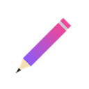

<div align="center">

  

  # AutoDraw Extension

  **Automatic drawing on online drawing games**

  [](https://github.com/MCookinho/AutoDraw-Extension)
  [](LICENSE)
  [](https://developer.chrome.com/docs/extensions/)
  []()

  <br>

  Upload an image and AutoDraw will automatically draw it on the game canvas,
  using the available palette colors, with strokes that mimic a real drawing.

  <br>

  [**How to Install**](#how-to-install) &bull; [**How to Use**](#how-to-use) &bull; [**Supported Sites**](#supported-sites) &bull; [**Features**](#features)

</div>

---

## What is AutoDraw?

AutoDraw is a browser extension for Chromium-based browsers (Chrome, Edge, Brave) that automates drawing on online games. It processes an image you upload, maps the colors to the game's available palette, and draws pixel by pixel using the Chrome DevTools Protocol (CDP) to simulate real mouse events.

### How It Works

```
  Your Image           Processing            Drawing on Game
 ┌──────────┐      ┌──────────────┐      ┌──────────────────┐
 │  Upload   │ ──>  │ Resize       │ ──>  │  CDP mouse moves │
 │  any      │      │ Map colors   │      │  Correct colors  │
 │  image    │      │ Group areas  │      │  Chosen mode     │
 └──────────┘      └──────────────┘      └──────────────────┘
```

---

## Features

<table>
<tr>
<td width="50%">

### Draw Modes

| Mode | Description |
|:-----|:------------|
| **Zigzag** | Back-and-forth fill, most natural look |
| **Spiral** | Draws outward from the center |
| **Edges First** | Outlines the region, then fills |
| **Random** | Segments in random order |
| **Inside Out** | Starts at center, moves outward |

</td>
<td width="50%">

### Controls

| Setting | Description |
|:--------|:------------|
| **Speed** | 1 to 100 (higher = faster) |
| **Resolution** | 16 to 256 pixels (image detail) |
| **Color delay** | 0 to 500ms pause between colors |
| **Anti-aliasing** | Intermediate points at color edges |
| **Auto-start** | Begin drawing when overlay opens |

</td>
</tr>
</table>

### Tracing Mode

A semi-transparent overlay of the reference image on top of the game canvas, with adjustable filters:

- **Opacity** — Controls transparency (5% to 100%)
- **Scale** — Resizes the overlay (20% to 300%)
- **Filters** — Brightness, contrast, saturation, grayscale, invert, edge detection
- **Eyedropper** — Press **SPACE** over the image to pick the color at that point

### Keyboard Shortcuts

| Shortcut | Action |
|:---------|:-------|
| `Ctrl+Shift+D` | Toggle overlay |
| `Ctrl+Shift+S` | Start drawing |
| `Ctrl+Shift+X` | Stop drawing |
| `Ctrl+Shift+T` | Toggle tracing mode |

### More

- **3 languages** — English, Portugues, Espanol
- **Dark/Light theme** — Glassmorphism interface
- **Export/Import** — Save and restore your settings
- **Palette** — View available game colors
- **Persistence** — Image saved automatically, survives page refresh

---

## Supported Sites

| Site | URL | Status |
|:-----|:----|:-------|
| Gartic | `gartic.io` | Supported |
| Gartic Phone | `garticphone.com` | Supported |
| Sketch.io | `sketch.io` | Supported |
| Drawize | `drawize.com` | Supported |

---

## How to Install

<br>

> **No Chrome Web Store needed!** You load the extension directly from the folder.

<br>

### Step 1 — Download the Repository

```bash
git clone https://github.com/MCookinho/AutoDraw-Extension.git
```

Or click **Code > Download ZIP** on GitHub and extract it.

<br>

### Step 2 — Open the Extensions Page

In your browser's address bar, type:

```
chrome://extensions/
```

<br>

### Step 3 — Enable Developer Mode

In the top-right corner, toggle **"Developer mode"**:

```
[ ] Developer mode  ──>  [x] Developer mode
```

<br>

### Step 4 — Load the Extension

1. Click **"Load unpacked"**
2. Select the `autodraw-extension` folder
3. Done! The AutoDraw icon appears in your toolbar

<br>

### For Firefox

1. Open `about:debugging#/runtime/this-firefox`
2. Click **"Load Temporary Add-on"**
3. Select any file inside the folder

---

## How to Use

<br>

### 1. Open a Supported Game

Open Gartic Phone (or any supported site) and join a drawing room.

<br>

### 2. Upload an Image

Click the AutoDraw icon and drag an image or click to select one.

```
┌─────────────────────────────────┐
│                                 │
│   ┌───────────────────────┐     │
│   │                       │     │
│   │   Drop image here     │     │
│   │   or click to upload   │     │
│   │                       │     │
│   │   PNG, JPG, GIF, MP4  │     │
│   └───────────────────────┘     │
│                                 │
└─────────────────────────────────┘
```

<br>

### 3. Open the Tools

Click **"Open Tools"**. A floating overlay will appear on the game.

<br>

### 4. Select the Drawing Area

- **Canvas** — Auto-detects the game canvas
- **Select** — Draw a rectangle manually

<br>

### 5. Start Drawing

Click **"Start drawing"** and wait for the progress bar to reach 100%.

<br>

### Important: Debugger

Gartic Phone requires you to click **"Proceed"** on the yellow bar at the top of the page. Without this, CDP cannot control the mouse.

---

## Project Structure

```
autodraw-extension/
├── manifest.json                  Extension config (Manifest V3)
│
├── background/
│   └── background.js              Service worker (shortcuts + CDP)
│
├── popup/
│   ├── popup.html                 Popup interface
│   ├── popup.css                  Glassmorphism styles
│   └── popup.js                   Popup logic
│
├── content/
│   ├── content.js                 Main script (popup <-> adapter bridge)
│   ├── overlay.js                 Floating overlay
│   ├── overlay.css                Overlay styles
│   ├── area-selector.js           Manual area selection
│   ├── area-selector.css          Selector styles
│   └── site-adapters/
│       ├── gartic.js              Gartic adapter
│       ├── gartic-phone.js        Gartic Phone adapter
│       ├── sketch.js              Sketch.io adapter
│       └── drawize.js             Drawize adapter
│
├── shared/
│   ├── i18n.js                    Internationalization (EN/PT/ES)
│   ├── constants.js               Config and defaults
│   ├── color-matcher.js           RGB color matching
│   ├── image-processor.js         Image processing
│   └── drawing-engine.js          CDP drawing engine
│
└── icons/                         Extension icons
```

---

## Development

### Tech Stack

- **Manifest V3** — Modern Chrome extension architecture
- **Chrome DevTools Protocol** — Direct mouse control via CDP
- **Canvas API** — Image processing and analysis
- **React Fiber Walking** — Color state detection in React apps
- **Glassmorphism** — UI with blur, transparency, and gradients

### Adding Support for a New Site

1. Create an adapter in `content/site-adapters/`
2. Implement the required methods:

```javascript
window.AutoDraw.NewSiteAdapter = (() => {
  function init() { /* detect canvas and tools */ }
  function isActive() { /* return true if canvas was found */ }
  function getCanvas() { /* return the canvas element */ }
  function setColor(hexColor) { /* set the active color in the game */ }
  function refresh() { /* re-detect canvas and tools */ }
  return { name: 'NewSiteAdapter', init, isActive, getCanvas, setColor, refresh };
})();
```

3. Add the site to `SUPPORTED_SITES` in `shared/constants.js`
4. Add the site to `host_permissions` and `content_scripts` in `manifest.json`

---

## Troubleshooting

| Problem | Solution |
|:--------|:---------|
| Canvas not found | Make sure you're in an active drawing room |
| Yellow bar appearing | Click **"Proceed"** to enable CDP |
| Wrong colors | Check the Palette tab in the popup |
| Drawing too slow | Lower the resolution or increase the speed |
| Image won't load | Reload the page and reopen the overlay |
| Overlay won't open | Make sure you're on a supported site |

---

## License

[MIT](LICENSE) — Feel free to use, modify, and distribute.

---

<div align="center">

Made with dedication by **MCookinho**

[](https://github.com/MCookinho)

</div>
